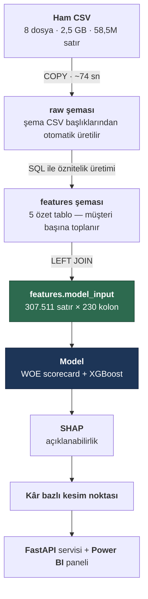

# Kredi Risk Skorlama Platformu

Kredi başvurularının temerrüt olasılığını tahmin eden, uçtan uca bir risk skorlama sistemi.
Veri yükleme ve öznitelik üretiminden model servisine kadar tüm adımlar tekrarlanabilir
şekilde kurgulanmıştır.

> **Durum:** Geliştirme sürüyor. Tamamlanan ve planlanan adımlar aşağıdaki yol haritasında işaretlidir.

---

## İş problemi

Bir finans kuruluşu için en pahalı iki hata vardır:

1. **Ödeyecek müşteriye kredi vermemek** → kaçırılan gelir
2. **Ödemeyecek müşteriye kredi vermek** → doğrudan zarar

İkincisi genellikle çok daha pahalıdır: bir müşteriden elde edilen faiz geliri,
batan bir kredinin anaparasının yanında küçük kalır. Bu asimetri yüzünden proje
yalnızca "model doğruluğu" ile değil, **beklenen kâr** ile de değerlendirilir.

Veri setinde başvuruların **%8,07'si** temerrüde düşmüştür. Bu dengesizlik,
accuracy metriğini anlamsız kılar (hiç kimseye kredi vermeyen bir model %92 "doğru"
olurdu); bunun yerine ROC-AUC, PR-AUC, Gini ve KS istatistikleri kullanılmaktadır.

---

## Veri

[Home Credit Default Risk](https://www.kaggle.com/competitions/home-credit-default-risk)
veri seti — 8 ilişkisel tablo, **~58,5 milyon satır**, 2,5 GB.

| Tablo | Satır | İçerik |
|---|---:|---|
| `application_train` | 307.511 | Başvuru anındaki demografik ve finansal bilgiler (122 kolon) |
| `application_test` | 48.744 | Tahmin edilecek başvurular |
| `bureau` | 1.716.428 | Diğer kuruluşlardaki krediler *(Türkiye'deki karşılığı: KKB / Findeks raporu)* |
| `bureau_balance` | 27.299.925 | O kredilerin aylık ödeme geçmişi |
| `previous_application` | 1.670.214 | Kurumdaki geçmiş başvurular ve sonuçları |
| `installments_payments` | 13.605.401 | Taksit ödeme davranışı |
| `pos_cash_balance` | 10.001.358 | Taksitli satış kredilerinin aylık durumu |
| `credit_card_balance` | 3.840.312 | Kredi kartı limit kullanımı |

Ham veri repoda tutulmaz (`.gitignore`); Kaggle'dan indirilip `data/raw/` altına konur.

---

## Mimari



**Tasarım kararı:** Öznitelik üretimi pandas yerine **SQL'de**, veritabanının içinde
yapılır. 58,5 milyon satırı Python'a taşımak yerine hesaplamayı verinin yanına
götürmek hem çok daha hızlıdır hem de üretim ortamlarındaki gerçek pratiktir.

### Öznitelik tabloları

| Tablo | Kaynak | Neyi ölçüyor | Müşteri |
|---|---|---|---:|
| `bureau_agg` | bureau + bureau_balance (27M) | Diğer kuruluşlardaki kredi ve gecikme geçmişi | 305.811 |
| `previous_app_agg` | previous_application | Geçmiş başvurular, red oranı ve red sebepleri | 338.857 |
| `installments_agg` | installments_payments (13,6M) | Fiili taksit ödeme davranışı, gecikme oranı | 339.587 |
| `pos_cash_agg` | pos_cash_balance (10M) | Taksitli/nakit kredilerin aylık durumu | 337.252 |
| `credit_card_agg` | credit_card_balance (3,8M) | Limit kullanımı, nakit avans, asgari ödeme | 103.558 |

Her öznitelik, eklenmeden önce hedef değişkene karşı dilimlenerek **monotonluk
açısından test edilmiştir**. Testte bir kırılma bulunan `inst_dpd_max` (en uzun
gecikme) özniteliği elenmemiş, ancak seçilim etkisi nedeniyle güvenilmez olduğu
notlanmış ve yerine oran tabanlı karşılığı öne çıkarılmıştır.

## Proje yapısı

```
credit-risk-platform/
├── docker/
│   └── docker-compose.yml          PostgreSQL 16 + kalıcı volume + CSV mount
├── src/
│   └── generate_ddl.py             CSV başlıklarından CREATE TABLE üretir
├── sql/
│   ├── 00_init/                    şema tanımı (otomatik üretilir)
│   ├── 01_staging/                 COPY ile yükleme + indeksler
│   └── 02_features/                öznitelik üretimi (SQL)
├── notebooks/                      modelleme ve analiz
├── models/                         eğitilmiş model dosyaları
├── reports/                        çıktılar ve grafikler
├── data/raw/                       ham CSV (repoda tutulmaz)
├── .env.example                    ortam değişkeni şablonu
└── requirements.txt
```

SQL dosyaları **numaralandırılmıştır**; sıra, çalıştırma sırasıdır.

---

## Şu ana kadarki bulgular

Dış kredi geçmişindeki gecikme oranı ile temerrüt arasında **düzgün artan** bir ilişki:

| Geçmişte gecikmeli ay oranı | Müşteri | Temerrüt oranı |
|---|---:|---:|
| Hiç gecikme yok | 61.179 | %7,22 |
| %0–5 | 22.253 | %8,75 |
| %5–20 | 7.281 | %12,31 |
| %20+ | 1.518 | **%16,34** |

Kredi kartı **limit kullanım oranı** ise en güçlü tekil sinyal olarak öne çıktı:

| Ortalama limit kullanımı | Müşteri | Temerrüt oranı |
|---|---:|---:|
| %10'un altı | 33.574 | %5,44 |
| %10–40 | 19.218 | %7,18 |
| %40–80 | 22.809 | %10,71 |
| %80 üzeri | 10.435 | **%17,09** |

Ayrıca dikkat çekici bir bulgu: **kredi geçmişi hiç olmayan** müşterilerin temerrüt
oranı (%10,12), temiz geçmişi olanlardan (%7,57) **daha yüksektir**. Bankacılıkta
*thin file / credit invisible* olarak bilinen bu durum nedeniyle eksik değerler
ortalama ile doldurulmayacak, **kendi başına bir kategori** olarak modellenecektir.

---

## Yol haritası

- [x] Docker üzerinde PostgreSQL 16, tekrarlanabilir kurulum
- [x] CSV başlıklarından otomatik `CREATE TABLE` üretimi (~350 kolon)
- [x] `COPY` ile toplu yükleme + indeksler + `ANALYZE`
- [x] 5 öznitelik tablosu: dış kredi geçmişi, geçmiş başvurular, taksit ödemeleri, POS/nakit kredi, kredi kartı
- [x] Başvuru içi oran öznitelikleri (kredi/gelir, DTI, LTV, kişi başı gelir, dış skor özetleri)
- [x] `features.model_input` — 307.511 satır × 230 kolon, müşteri başına tek satır
- [ ] WOE dönüşümü + lojistik regresyon scorecard
- [ ] XGBoost karşılaştırması, Gini / KS
- [ ] SHAP ile açıklanabilirlik
- [ ] Kâr bazlı kesim noktası optimizasyonu
- [ ] PSI ile popülasyon kayması izleme
- [ ] MLflow ile deney takibi
- [ ] FastAPI skorlama servisi
- [ ] Power BI izleme paneli

---

## Kurulum

**Gereksinimler:** Docker, Python 3.11+, Kaggle hesabı

```bash
git clone https://github.com/0busrayavuz/credit-risk-scoring-platform.git
cd credit-risk-scoring-platform
```

`.env.example` dosyasını `.env` adıyla kopyalayıp şifreyi düzenleyin
(Windows: `copy .env.example .env` · Linux/macOS: `cp .env.example .env`).

Veriyi indir:

```bash
kaggle competitions download -c home-credit-default-risk -p data/raw
```

Veritabanını başlat ve şemayı kur:

```bash
docker compose --env-file .env -f docker/docker-compose.yml up -d
python src/generate_ddl.py
docker exec credit_risk_pg psql -U credit -d credit_risk -f /sql/00_init/01_create_raw_tables.sql
docker exec credit_risk_pg psql -U credit -d credit_risk -f /sql/01_staging/02_load_raw.sql
docker exec credit_risk_pg psql -U credit -d credit_risk -f /sql/01_staging/03_indexes.sql
```

---

## Teknolojiler

PostgreSQL 16 · Docker · Python · pandas · SQLAlchemy · scikit-learn · XGBoost · SHAP · MLflow · FastAPI · Power BI
