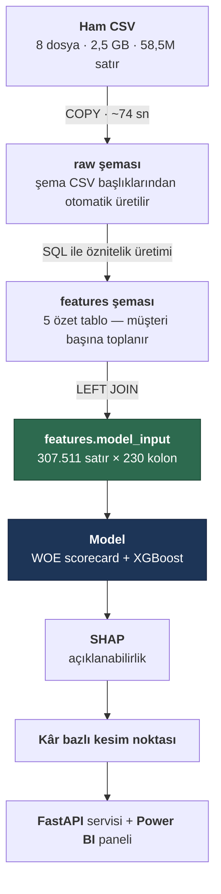
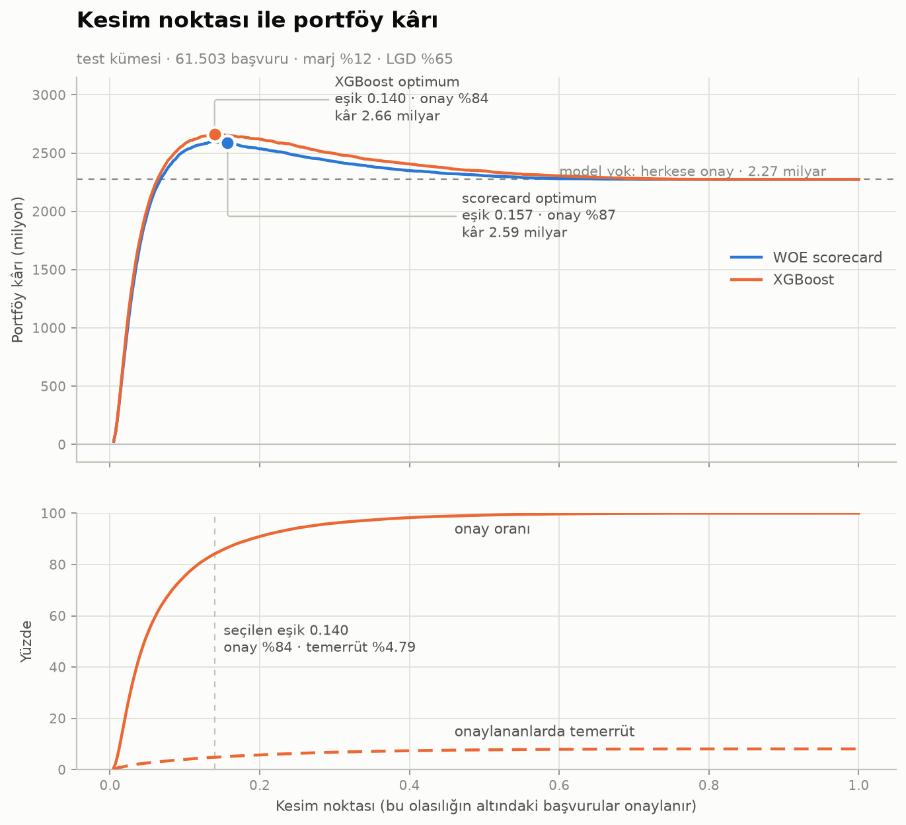
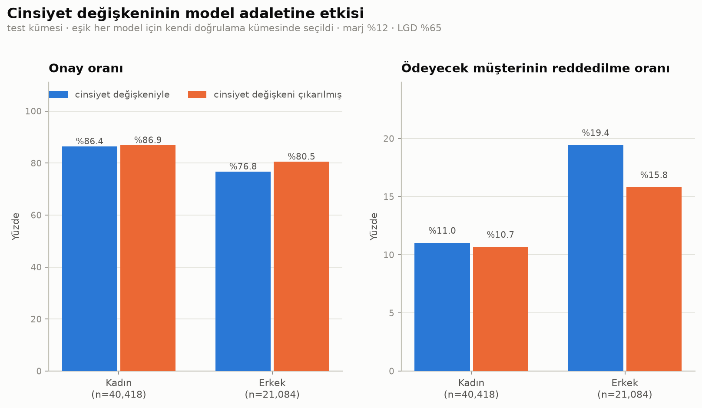

# Kredi Risk Skorlama Platformu

Kredi başvurularının temerrüt olasılığını tahmin eden, uçtan uca bir risk skorlama sistemi.
Veri yükleme ve öznitelik üretiminden model servisine kadar tüm adımlar tekrarlanabilir
şekilde kurgulanmıştır.

> **Durum:** Geliştirme sürüyor. Tamamlanan ve planlanan adımlar aşağıdaki yol haritasında işaretlidir.

---

## İş problemi

Bir finans kuruluşu için en pahalı iki hata vardır:

1. **Ödeyecek müşteriye kredi vermemek** → kaçırılan gelir
2. **Ödemeyecek müşteriye kredi vermek** → doğrudan zarar

İkincisi genellikle çok daha pahalıdır: bir müşteriden elde edilen faiz geliri,
batan bir kredinin anaparasının yanında küçük kalır. Bu asimetri yüzünden proje
yalnızca "model doğruluğu" ile değil, **beklenen kâr** ile de değerlendirilir.

Veri setinde başvuruların **%8,07'si** temerrüde düşmüştür. Bu dengesizlik,
accuracy metriğini anlamsız kılar (hiç kimseye kredi vermeyen bir model %92 "doğru"
olurdu); bunun yerine ROC-AUC, PR-AUC, Gini ve KS istatistikleri kullanılmaktadır.

---

## Veri

[Home Credit Default Risk](https://www.kaggle.com/competitions/home-credit-default-risk)
veri seti — 8 ilişkisel tablo, **~58,5 milyon satır**, 2,5 GB.

| Tablo | Satır | İçerik |
|---|---:|---|
| `application_train` | 307.511 | Başvuru anındaki demografik ve finansal bilgiler (122 kolon) |
| `application_test` | 48.744 | Tahmin edilecek başvurular |
| `bureau` | 1.716.428 | Diğer kuruluşlardaki krediler *(Türkiye'deki karşılığı: KKB / Findeks raporu)* |
| `bureau_balance` | 27.299.925 | O kredilerin aylık ödeme geçmişi |
| `previous_application` | 1.670.214 | Kurumdaki geçmiş başvurular ve sonuçları |
| `installments_payments` | 13.605.401 | Taksit ödeme davranışı |
| `pos_cash_balance` | 10.001.358 | Taksitli satış kredilerinin aylık durumu |
| `credit_card_balance` | 3.840.312 | Kredi kartı limit kullanımı |

Ham veri repoda tutulmaz (`.gitignore`); Kaggle'dan indirilip `data/raw/` altına konur.

---

## Mimari



**Tasarım kararı:** Öznitelik üretimi pandas yerine **SQL'de**, veritabanının içinde
yapılır. 58,5 milyon satırı Python'a taşımak yerine hesaplamayı verinin yanına
götürmek hem çok daha hızlıdır hem de üretim ortamlarındaki gerçek pratiktir.

### Öznitelik tabloları

| Tablo | Kaynak | Neyi ölçüyor | Müşteri |
|---|---|---|---:|
| `bureau_agg` | bureau + bureau_balance (27M) | Diğer kuruluşlardaki kredi ve gecikme geçmişi | 305.811 |
| `previous_app_agg` | previous_application | Geçmiş başvurular, red oranı ve red sebepleri | 338.857 |
| `installments_agg` | installments_payments (13,6M) | Fiili taksit ödeme davranışı, gecikme oranı | 339.587 |
| `pos_cash_agg` | pos_cash_balance (10M) | Taksitli/nakit kredilerin aylık durumu | 337.252 |
| `credit_card_agg` | credit_card_balance (3,8M) | Limit kullanımı, nakit avans, asgari ödeme | 103.558 |

Her öznitelik, eklenmeden önce hedef değişkene karşı dilimlenerek **monotonluk
açısından test edilmiştir**. Testte bir kırılma bulunan `inst_dpd_max` (en uzun
gecikme) özniteliği elenmemiş, ancak seçilim etkisi nedeniyle güvenilmez olduğu
notlanmış ve yerine oran tabanlı karşılığı öne çıkarılmıştır.

## Proje yapısı

```
credit-risk-platform/
├── docker/
│   └── docker-compose.yml          PostgreSQL 16 + kalıcı volume + CSV mount
├── src/
│   └── generate_ddl.py             CSV başlıklarından CREATE TABLE üretir
├── sql/
│   ├── 00_init/                    şema tanımı (otomatik üretilir)
│   ├── 01_staging/                 COPY ile yükleme + indeksler
│   └── 02_features/                öznitelik üretimi (SQL)
├── notebooks/                      modelleme ve analiz
├── models/                         eğitilmiş model dosyaları
├── reports/                        çıktılar ve grafikler
├── data/raw/                       ham CSV (repoda tutulmaz)
├── .env.example                    ortam değişkeni şablonu
└── requirements.txt
```

SQL dosyaları **numaralandırılmıştır**; sıra, çalıştırma sırasıdır.

---

## Şu ana kadarki bulgular

Dış kredi geçmişindeki gecikme oranı ile temerrüt arasında **düzgün artan** bir ilişki:

| Geçmişte gecikmeli ay oranı | Müşteri | Temerrüt oranı |
|---|---:|---:|
| Hiç gecikme yok | 61.179 | %7,22 |
| %0–5 | 22.253 | %8,75 |
| %5–20 | 7.281 | %12,31 |
| %20+ | 1.518 | **%16,34** |

Kredi kartı **limit kullanım oranı** ise en güçlü tekil sinyal olarak öne çıktı:

| Ortalama limit kullanımı | Müşteri | Temerrüt oranı |
|---|---:|---:|
| %10'un altı | 33.574 | %5,44 |
| %10–40 | 19.218 | %7,18 |
| %40–80 | 22.809 | %10,71 |
| %80 üzeri | 10.435 | **%17,09** |

Ayrıca dikkat çekici bir bulgu: **kredi geçmişi hiç olmayan** müşterilerin temerrüt
oranı (%10,12), temiz geçmişi olanlardan (%7,57) **daha yüksektir**. Bankacılıkta
*thin file / credit invisible* olarak bilinen bu durum nedeniyle eksik değerler
ortalama ile doldurulmayacak, **kendi başına bir kategori** olarak modellenecektir.

---

## Model sonuçları

Doğrulama kümesi (61.502 başvuru, eğitimde kullanılmadı):

| Model | AUC | Gini | KS | PR-AUC | Değişken |
|---|---:|---:|---:|---:|---:|
| Tek değişken (`ext_source_mean`) | 0,7135 | 0,4271 | 0,3248 | 0,1866 | 1 |
| Lojistik regresyon | 0,7305 | 0,4611 | 0,3459 | 0,2066 | 10 |
| **WOE scorecard** | **0,7634** | **0,5268** | **0,4004** | **0,2382** | **54** |

Puan bandına göre gerçekleşen temerrüt (yüksek puan = düşük risk):

| Puan bandı | Müşteri | Temerrüt |
|---|---:|---:|
| 474 – 497 | 30 | %66,67 |
| 520 – 543 | 2.285 | %30,85 |
| 589 – 612 | 17.675 | %4,82 |
| 657 – 680 | 1.009 | %0,89 |
| 680 – 703 | 49 | %0,00 |

## Kâr bazlı kesim noktası

Bir modelin değeri AUC ile değil, ürettiği kararla ölçülür. Kredi riskinde iki hatanın
maliyeti simetrik değildir: batan bir kredinin anaparası, iyi bir müşteriden yıllar
içinde kazanılan marjın çok üzerindedir. Bu yüzden yaygın "olasılık 0,5'i geçerse
reddet" kuralı yanlıştır — o eşik, iki hatanın eşit maliyetli olduğunu varsayar.

Eşik **doğrulama** kümesinde kâr fonksiyonu maksimize edilerek seçildi, sonuç
**test** kümesinde raporlandı.



Test kümesi (61.503 başvuru · marj %12 · LGD %65 varsayımıyla):

| Senaryo | Onay oranı | Onaylananlarda temerrüt | Portföy kârı |
|---|---:|---:|---:|
| Model yok — herkese onay | %100 | %8,07 | 2,31 milyar |
| Sabit 0,50 eşiği | %99,3 | %7,72 | 2,38 milyar |
| WOE scorecard — optimum (0,152) | %85,8 | %5,33 | 2,61 milyar |
| **XGBoost — optimum (0,135)** | **%83,1** | **%4,71** | **2,68 milyar** |

**Projenin en önemli bulgusu:** model yükseltmesi (scorecard → XGBoost) +64 milyon
katkı sağlarken, eşik kararı (0,50 → 0,135) **+300 milyon** katkı sağlıyor.
Eşiği doğru seçmek, modeli yükseltmekten yaklaşık **beş kat** daha değerli.
Varsayılan 0,5 eşiğiyle çalışan bir sistem, başvuruların %99,3'ünü onaylar ve
modelin sunduğu değerin neredeyse tamamını kullanmadan bırakır.

Marj ve LGD birer varsayımdır; 5×5'lik bir duyarlılık analizi ile optimum eşiğin
bu varsayımlara bağlılığı ölçülmüştür (onay oranı %64–%97 aralığında değişiyor).

## Model adaleti ve regülasyon uyumu

SHAP analizi, modelin **cinsiyeti (`code_gender`) 4. en önemli değişken** olarak
kullandığını ortaya çıkardı (ortalama |SHAP| 0,1154 — toplam önemin %3'ü).
Finansal hizmetlerde cinsiyete dayalı ayrım ABD'de Equal Credit Opportunity Act,
AB'de 2004/113/EC direktifi ile yasaklanmıştır; Türkiye'de de bankalar ayrımcılık
yasağına tabidir. Bulgu ölçüldü ve giderildi.



**Maliyet ihmal edilebilir.** Değişken çıkarıldığında AUC 0,7830 → 0,7816
(−0,0013), portföy kârı 2,68 → 2,67 milyar (−%0,18).

**Ancak kolonu silmek tek başına yetmiyor.** Kalan 227 değişkenden cinsiyet
**AUC 0,911** ile tahmin edilebiliyor. En güçlü vekil, açık farkla araba
sahipliği (`flag_own_car`); ardından meslek ve gelir geliyor. Bu nedenle
grup bazlı adalet metrikleri izlemeye devam edilmelidir — hassas değişkeni
silip "model artık adil" demek, ayrımcılığı yok etmez, yalnızca ölçülemez hâle
getirir.

| Ölçüt | Cinsiyetli | Cinsiyetsiz | |
|---|---:|---:|---|
| Onay oranı farkı (demographic parity) | %9,68 | %6,35 | iyileşti |
| Ödeyecek müşterinin reddedilme farkı (equal opportunity) | %8,41 | %5,13 | iyileşti |
| Onaylananlarda temerrüt farkı (predictive parity) | %0,91 | %1,18 | kötüleşti |

Üçüncü ölçütün kötüleşmesi bir kusur değil, **imkânsızlık teoreminin** sonucudur
(Kleinberg ve ark.; Chouldechova, 2016–17): grupların gerçek temerrüt oranları
farklıyken (kadın %7,16, erkek %9,82) bir model aynı anda hem eşit hata oranlarına
hem eşit isabet oranına sahip olamaz. Bu projede **equal opportunity** ölçütü
tercih edilmiştir: *ödeyecek bir müşterinin reddedilme olasılığı cinsiyetine
bağlı olmamalıdır.* Bu ölçüt, kimseye hak etmediği krediyi vermeyi gerektirmediği
için kredi riskinde en savunulabilir olanıdır.

### Değişken seçimi: üç aşamalı ve denetlenebilir

Skorkartın bankada kullanılabilmesi için istatistiksel başarı yetmez; **her
satırının iş mantığına uygun olması** gerekir. İlk denemede IV'ye göre seçilen
108 değişkenin 35'inde katsayı işareti ters çıktı — örneğin kredi kartı limit
kullanımı arttıkça müşteri daha çok puan alıyordu. Sebep çoklu doğrusal
bağlantıydı (`age_years` ile `days_birth` arasında r = 0,999 gibi).

Bunun üzerine üç aşamalı bir seçim süreci kuruldu:

```
228 değişken
  → 108   IV filtresi (0,02 – 0,60)
  →  65   korelasyon budama (|r| > 0,75 olan çiftlerden IV'si düşük olan elenir)
  →  54   işaret düzeltme (katsayısı iş mantığına aykırı olanlar yinelemeli elenir)
```

Sonuç: **54/54 değişkende puanlar doğru yönde**, AUC kaybı yalnızca 0,0019.
Her eğitimde bu denetim otomatik çalışır; yön bozulursa süreç hata vererek durur.

## Yol haritası

- [x] Docker üzerinde PostgreSQL 16, tekrarlanabilir kurulum
- [x] CSV başlıklarından otomatik `CREATE TABLE` üretimi (~350 kolon)
- [x] `COPY` ile toplu yükleme + indeksler + `ANALYZE`
- [x] 5 öznitelik tablosu: dış kredi geçmişi, geçmiş başvurular, taksit ödemeleri, POS/nakit kredi, kredi kartı
- [x] Başvuru içi oran öznitelikleri (kredi/gelir, DTI, LTV, kişi başı gelir, dış skor özetleri)
- [x] `features.model_input` — 307.511 satır × 230 kolon, müşteri başına tek satır
- [x] WOE dönüşümü + lojistik regresyon scorecard (Gini 0,527 · KS 0,400)
- [x] XGBoost karşılaştırması (Gini 0,566 · KS 0,434)
- [x] Kâr bazlı kesim noktası optimizasyonu + duyarlılık analizi
- [x] SHAP ile açıklanabilirlik (global denetim + tekil karar gerekçesi)
- [x] Model adaleti: hassas değişken denetimi, vekil sızıntı testi, grup metrikleri
- [ ] PSI ile popülasyon kayması izleme
- [ ] MLflow ile deney takibi
- [ ] FastAPI skorlama servisi
- [ ] Power BI izleme paneli

---

## Kurulum

**Gereksinimler:** Docker, Python 3.11+, Kaggle hesabı

```bash
git clone https://github.com/0busrayavuz/credit-risk-scoring-platform.git
cd credit-risk-scoring-platform
```

`.env.example` dosyasını `.env` adıyla kopyalayıp şifreyi düzenleyin
(Windows: `copy .env.example .env` · Linux/macOS: `cp .env.example .env`).

Veriyi indir:

```bash
kaggle competitions download -c home-credit-default-risk -p data/raw
```

Veritabanını başlat ve şemayı kur:

```bash
docker compose --env-file .env -f docker/docker-compose.yml up -d
python src/generate_ddl.py
docker exec credit_risk_pg psql -U credit -d credit_risk -f /sql/00_init/01_create_raw_tables.sql
docker exec credit_risk_pg psql -U credit -d credit_risk -f /sql/01_staging/02_load_raw.sql
docker exec credit_risk_pg psql -U credit -d credit_risk -f /sql/01_staging/03_indexes.sql
```

---

## Teknolojiler

PostgreSQL 16 · Docker · Python · pandas · SQLAlchemy · scikit-learn · XGBoost · SHAP · MLflow · FastAPI · Power BI
