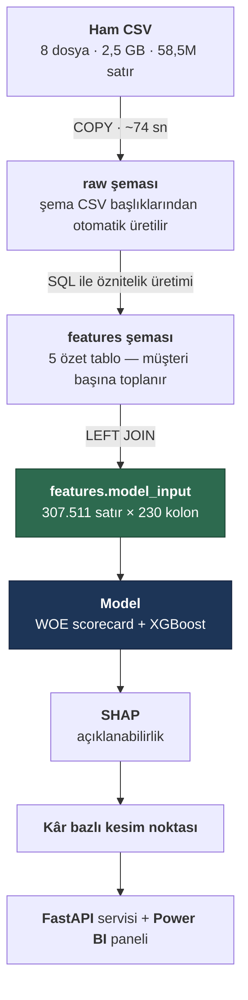
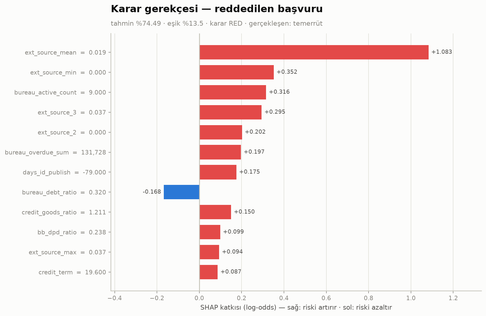
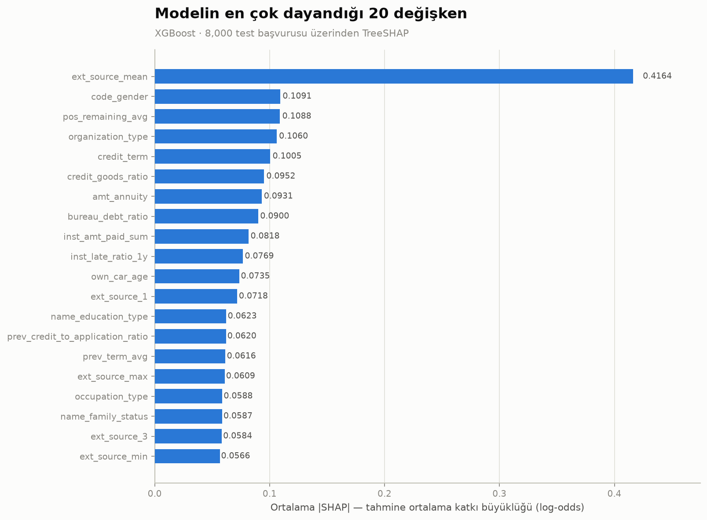
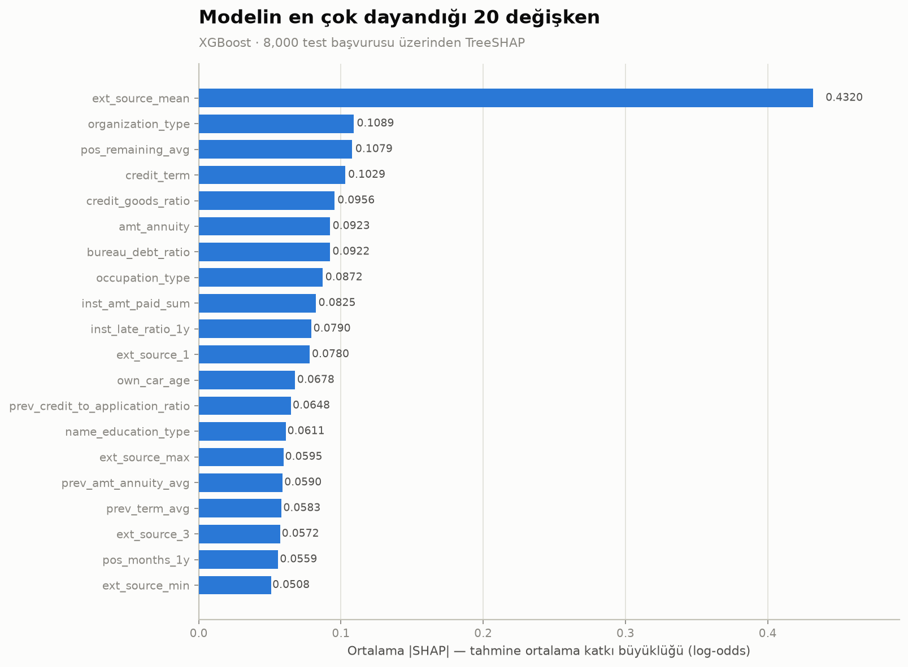
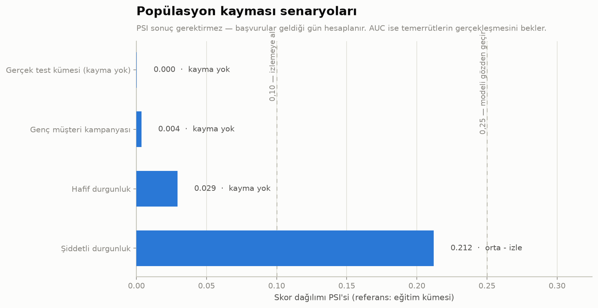

# Kredi Risk Skorlama Platformu

[](LICENSE)
[](#kurulum)
[](#kurulum)
[](#testler)

Kredi başvurularının temerrüt olasılığını tahmin eden, kararı gerekçelendiren ve
kâr etkisini ölçen uçtan uca bir risk skorlama sistemi. Veri yüklemeden model
servisine kadar tüm adımlar tekrarlanabilir şekilde kurgulanmıştır.

**Özet sonuç.** 8 tablodaki 58,5 milyon satır, müşteri başına tek satıra indirgendi
(307.511 × 230). XGBoost doğrulama kümesinde **Gini 0,566 · KS 0,430**; kâr bazlı
kesim noktasıyla portföy kârı **+%16,6**. Servise konan model, gerekçeli bir
**korumalı özellik politikasından** geçirildi (cinsiyet, medeni durum ve aile
yapısı değişkenleri çıkarıldı — maliyet: 0,002 AUC); karar eşiği kâr fonksiyonuyla
belirlendi.

| Katman | Ne yapıldı |
|---|---|
| Veri | PostgreSQL 16, `COPY` ile 58,5M satır / 74 sn, otomatik şema üretimi |
| Öznitelik | 5 özet tablo + oranlar — **tamamı SQL'de**, pandas'a veri taşınmadan |
| Model | WOE scorecard (52 değişken, denetlenebilir) + XGBoost karşılaştırması |
| Karar | Kâr bazlı kesim noktası, 5×5 duyarlılık analizi |
| Güven | SHAP gerekçelendirme, adalet denetimi, PSI izleme, 14 test |
| Servis | FastAPI (gerekçeli karar + veri kalitesi denetimi), MLflow, Power BI katmanı |

---

## İş problemi

Bir finans kuruluşu için en pahalı iki hata vardır:

1. **Ödeyecek müşteriye kredi vermemek** → kaçırılan gelir
2. **Ödemeyecek müşteriye kredi vermek** → doğrudan zarar

İkincisi genellikle çok daha pahalıdır: bir müşteriden elde edilen faiz geliri,
batan bir kredinin anaparasının yanında küçük kalır. Bu asimetri yüzünden proje
yalnızca "model doğruluğu" ile değil, **beklenen kâr** ile de değerlendirilir.

Veri setinde başvuruların **%8,07'si** temerrüde düşmüştür. Bu dengesizlik,
accuracy metriğini anlamsız kılar (hiç kimseye kredi vermeyen bir model %92 "doğru"
olurdu); bunun yerine ROC-AUC, PR-AUC, Gini ve KS istatistikleri kullanılmaktadır.

---

## Veri

[Home Credit Default Risk](https://www.kaggle.com/competitions/home-credit-default-risk)
veri seti — 8 ilişkisel tablo, **~58,5 milyon satır**, 2,5 GB.

| Tablo | Satır | İçerik |
|---|---:|---|
| `application_train` | 307.511 | Başvuru anındaki demografik ve finansal bilgiler (122 kolon) |
| `application_test` | 48.744 | Tahmin edilecek başvurular |
| `bureau` | 1.716.428 | Diğer kuruluşlardaki krediler *(Türkiye'deki karşılığı: KKB / Findeks raporu)* |
| `bureau_balance` | 27.299.925 | O kredilerin aylık ödeme geçmişi |
| `previous_application` | 1.670.214 | Kurumdaki geçmiş başvurular ve sonuçları |
| `installments_payments` | 13.605.401 | Taksit ödeme davranışı |
| `pos_cash_balance` | 10.001.358 | Taksitli satış kredilerinin aylık durumu |
| `credit_card_balance` | 3.840.312 | Kredi kartı limit kullanımı |

Ham veri repoda tutulmaz (`.gitignore`); Kaggle'dan indirilip `data/raw/` altına konur.

---

## Mimari



**Tasarım kararı:** Öznitelik üretimi pandas yerine **SQL'de**, veritabanının içinde
yapılır. 58,5 milyon satırı Python'a taşımak yerine hesaplamayı verinin yanına
götürmek hem çok daha hızlıdır hem de üretim ortamlarındaki gerçek pratiktir.

### Öznitelik tabloları

| Tablo | Kaynak | Neyi ölçüyor | Müşteri |
|---|---|---|---:|
| `bureau_agg` | bureau + bureau_balance (27M) | Diğer kuruluşlardaki kredi ve gecikme geçmişi | 305.811 |
| `previous_app_agg` | previous_application | Geçmiş başvurular, red oranı ve red sebepleri | 338.857 |
| `installments_agg` | installments_payments (13,6M) | Fiili taksit ödeme davranışı, gecikme oranı | 339.587 |
| `pos_cash_agg` | pos_cash_balance (10M) | Taksitli/nakit kredilerin aylık durumu | 337.252 |
| `credit_card_agg` | credit_card_balance (3,8M) | Limit kullanımı, nakit avans, asgari ödeme | 103.558 |

Her öznitelik, eklenmeden önce hedef değişkene karşı dilimlenerek **monotonluk
açısından test edilmiştir**. Testte bir kırılma bulunan `inst_dpd_max` (en uzun
gecikme) özniteliği elenmemiş, ancak seçilim etkisi nedeniyle güvenilmez olduğu
notlanmış ve yerine oran tabanlı karşılığı öne çıkarılmıştır.

## Proje yapısı

```
credit-risk-platform/
├── docker/
│   └── docker-compose.yml          PostgreSQL 16 + kalıcı volume + CSV mount
├── src/
│   └── generate_ddl.py             CSV başlıklarından CREATE TABLE üretir
├── sql/
│   ├── 00_init/                    şema tanımı (otomatik üretilir)
│   ├── 01_staging/                 COPY ile yükleme + indeksler
│   └── 02_features/                öznitelik üretimi (SQL)
├── notebooks/                      modelleme ve analiz
├── models/                         eğitilmiş model dosyaları
├── reports/                        çıktılar ve grafikler
├── data/raw/                       ham CSV (repoda tutulmaz)
├── .env.example                    ortam değişkeni şablonu
└── requirements.txt
```

SQL dosyaları **numaralandırılmıştır**; sıra, çalıştırma sırasıdır.

---

## Öznitelik bulguları

Her öznitelik, modele eklenmeden önce hedef değişkene karşı dilimlenerek ölçüldü.
Aşağıdakiler tahmin değil, veriden okunan sonuçlardır.

Dış kredi geçmişindeki gecikme oranı ile temerrüt arasında **düzgün artan** bir ilişki:

| Geçmişte gecikmeli ay oranı | Müşteri | Temerrüt oranı |
|---|---:|---:|
| Hiç gecikme yok | 61.179 | %7,22 |
| %0–5 | 22.253 | %8,75 |
| %5–20 | 7.281 | %12,31 |
| %20+ | 1.518 | **%16,34** |

Kredi kartı **limit kullanım oranı** ise en güçlü tekil sinyal olarak öne çıktı:

| Ortalama limit kullanımı | Müşteri | Temerrüt oranı |
|---|---:|---:|
| %10'un altı | 33.574 | %5,44 |
| %10–40 | 19.218 | %7,18 |
| %40–80 | 22.809 | %10,71 |
| %80 üzeri | 10.435 | **%17,09** |

Ayrıca dikkat çekici bir bulgu: **kredi geçmişi hiç olmayan** müşterilerin temerrüt
oranı (%10,12), temiz geçmişi olanlardan (%7,57) **daha yüksektir**. Bankacılıkta
*thin file / credit invisible* olarak bilinen bu durum nedeniyle eksik değerler
ortalama ile doldurulmayacak, **kendi başına bir kategori** olarak modellenecektir.

---

## Model sonuçları

Doğrulama kümesi (61.502 başvuru, eğitimde kullanılmadı):

| Model | AUC | Gini | KS | PR-AUC | Değişken |
|---|---:|---:|---:|---:|---:|
| Tek değişken (`ext_source_mean`) | 0,7150 | 0,4300 | 0,3253 | 0,1906 | 1 |
| Lojistik regresyon | 0,7355 | 0,4710 | 0,3492 | 0,2119 | 10 |
| WOE scorecard | 0,7640 | 0,5279 | 0,3973 | 0,2421 | 52 |
| **XGBoost** | **0,7828** | **0,5655** | **0,4295** | **0,2690** | 228 |

Yukarıdakiler **denetim** modelleridir — tüm değişkenlerle eğitilir ve modelin neye
dayandığını incelemek için kullanılırlar. Servise konan sürümler korumalı özellik
politikasından geçirilmiştir:

| Servise konan model | AUC | Gini | KS | Değişken |
|---|---:|---:|---:|---:|
| WOE scorecard (adil) | 0,7621 | 0,5241 | 0,3955 | 50 |
| **XGBoost (adil)** | **0,7807** | **0,5615** | **0,4290** | 224 |

Aşırı öğrenme kontrolü (XGBoost): eğitim 0,8666 · doğrulama 0,7828 · **test 0,7832**.
Test ile doğrulamanın örtüşmesi, bölmenin sızıntısız olduğunun doğrudan kanıtıdır.

Scorecard puan bandına göre gerçekleşen temerrüt (yüksek puan = düşük risk):

| Puan bandı | Müşteri | Temerrüt |
|---|---:|---:|
| 481 – 503 | 66 | %57,58 |
| 524 – 546 | 2.777 | %29,24 |
| 588 – 610 | 16.618 | %4,92 |
| 653 – 674 | 1.325 | %0,91 |

## Kâr bazlı kesim noktası

Bir modelin değeri AUC ile değil, ürettiği kararla ölçülür. Kredi riskinde iki hatanın
maliyeti simetrik değildir: batan bir kredinin anaparası, iyi bir müşteriden yıllar
içinde kazanılan marjın çok üzerindedir. Bu yüzden yaygın "olasılık 0,5'i geçerse
reddet" kuralı yanlıştır — o eşik, iki hatanın eşit maliyetli olduğunu varsayar.

Eşik **doğrulama** kümesinde kâr fonksiyonu maksimize edilerek seçildi, sonuç
**test** kümesinde raporlandı.


Test kümesi (61.503 başvuru · marj %12 · LGD %65 varsayımıyla):

| Senaryo | Onay oranı | Onaylananlarda temerrüt | Portföy kârı |
|---|---:|---:|---:|
| Model yok — herkese onay | %100 | %8,07 | 2,27 milyar |
| Sabit 0,50 eşiği | %99,3 | %7,71 | 2,34 milyar |
| WOE scorecard — optimum (0,142) | %84,3 | %5,09 | 2,60 milyar |
| **XGBoost — optimum (0,152)** | **%85,9** | **%5,03** | **2,65 milyar** |

**Projenin en önemli bulgusu:** model yükseltmesi (scorecard → XGBoost) +57 milyon
katkı sağlarken, eşik kararı (0,50 → 0,152) **+310 milyon** katkı sağlıyor.
Eşiği doğru seçmek, modeli yükseltmekten yaklaşık **beş kat** daha değerli.
Varsayılan 0,5 eşiğiyle çalışan bir sistem başvuruların %99,3'ünü onaylar ve
modelin sunduğu değerin neredeyse tamamını kullanmadan bırakır.

Optimum eşikte 2.305 batık kredi önleniyor, karşılığında 6.350 iyi müşteri
reddediliyor. Bu takas kâr fonksiyonu tarafından, sezgiyle değil hesapla belirlenir.

Marj ve LGD birer varsayımdır; 5×5'lik bir duyarlılık analizi ile optimum eşiğin
bu varsayımlara bağlılığı ölçülmüştür (onay oranı %59–%98 aralığında değişiyor).

## Açıklanabilirlik (SHAP)

Scorecard zaten okunabilir bir puan tablosu üretir. XGBoost ise 910 ağacın toplamıdır —
hiç kimse onu okuyarak *"bu müşteri neden reddedildi?"* sorusunu cevaplayamaz. SHAP bu
boşluğu doldurur ve iki ayrı ihtiyaca hizmet eder.

**Karar gerekçesi (yerel).** Reddedilen başvuru sahibine sebep bildirmek birçok ülkede
yasal zorunluluktur. SHAP bunu tek bir başvuru için üretir:



Gerçek bir reddedilen başvuru — tahmin %81, gerçekleşen sonuç: temerrüt. Dış kredi
skorunun düşüklüğü tek başına **+1,04 log-odds** katkı veriyor; ardından ödenmemiş
taksitler, yüksek kart bakiyesi ve 9 aktif kredi geliyor. Tek olumlu faktör mesleği.
Bu tablo, müşteriye iletilecek gerekçe metninin kendisidir.

**Model denetimi (global).** Model bir bütün olarak neye dayanıyor? Bu soru,
projenin en önemli bulgusunu ortaya çıkardı.

Denetim modeli — tüm değişkenlerle eğitilen, *incelemek için* var olan sürüm:



**`code_gender` ikinci sırada.** Bu grafik olmasaydı fark edilmeyecekti.
Bulgunun nasıl ele alındığı bir sonraki bölümde.

Servise konan model — korumalı özellik politikası uygulanmış sürüm:



| Sıra | Denetim modeli | | Servisteki model | |
|---:|---|---:|---|---:|
| 1 | `ext_source_mean` | 0,4164 | `ext_source_mean` | 0,4320 |
| 2 | **`code_gender`** | 0,1091 | `organization_type` | 0,1089 |
| 3 | `pos_remaining_avg` | 0,1088 | `pos_remaining_avg` | 0,1079 |

İki raporun ayrı tutulması bilinçlidir: **belgelenen model ile çalışan model aynı
olmalıdır.** İlk sürümde SHAP raporu denetim modeli üzerinde üretilmiş, README ise
temizlenmiş modeli anlatıyordu; bu tutarsızlık giderildi. `src/shap_analizi.py`
varsayılan olarak servisteki modeli inceler, `--denetim` bayrağıyla diğerini.

> Dikkat çeken bir ayrıntı: cinsiyet çıkarıldığında `organization_type`
> neredeyse tam olarak onun bıraktığı ağırlığı devralıyor (0,1089 ↔ 0,1091).
> Vekil sızıntı testi de meslek/kurum alanlarını cinsiyetin güçlü vekilleri
> arasında gösteriyor — bu, aşağıdaki bölümün ana temasıdır.

Değişken önemleri, SQL aşamasında ölçülen sinyalleri de doğruluyor —
`cc_utilization_avg_1y`, `inst_late_ratio_1y` ve `prev_refused_ratio` iki bağımsız
yöntemde de öne çıkıyor. Ayrıca son-12-ay (`_1y`) metrikleri tüm-zaman
karşılıklarından daha önemli çıktı: yakın geçmişin daha bilgilendirici olduğu
varsayımı ölçümle doğrulandı.

> SHAP değerleri XGBoost'un kendi TreeSHAP uygulamasından alınır (`pred_contribs=True`).
> Her çalıştırmada **toplanabilirlik** doğrulanır — temel değer ile katkıların toplamı
> modelin tahminini vermelidir; ölçülen sapma 5,8 × 10⁻⁷. Erken durdurma nedeniyle
> `iteration_range` verilmesi şarttır, aksi halde SHAP farklı sayıda ağaç kullanır ve
> katkılar tahminle örtüşmez.

## Model adaleti ve regülasyon uyumu

SHAP denetimi, modelin **cinsiyeti (`code_gender`) en önemli değişkenlerden biri**
olarak kullandığını ortaya çıkardı. İlk tepki yalnızca o kolonu çıkarmak oldu —
ancak sonraki denetimde bunun iki açıdan yetersiz olduğu görüldü: **medeni durum**
(`name_family_status`) da ECOA'da cinsiyetle *aynı listede* korumalı bir özellikti
ve modelde duruyordu; ayrıca cinsiyet yalnızca XGBoost'tan çıkarılmış, scorecard'da
bırakılmıştı.

Bunun üzerine denetim tesadüfe bırakılmaktan çıkarılıp **gerekçeli bir politikaya**
bağlandı (`src/korumali_ozellikler.py`) ve her modele aynı şekilde uygulandı.

**Kademe 1 — modelden çıkarılır:** `code_gender` (ECOA, AB 2004/113/EC),
`name_family_status` (ECOA'da açıkça korumalı), `cnt_children` ve `cnt_fam_members`
(aile yapısının yakın vekilleri).

**Kademe 2 — kullanılır, izlenir:** yaş (ECOA, istatistiksel geçerliliği gösterilmiş
skorlama sistemlerinde yaşın kullanımına izin verir) ve bölge derecesi (bölgesel
iktisadi koşullar meşru risk bilgisidir, ancak *redlining* endişesi taşır).

### Maliyet: ölçülebilir ama ihmal edilebilir

| Model | AUC (önce → sonra) | Gini kaybı | Değişken |
|---|---|---:|---|
| WOE scorecard | 0,7640 → 0,7621 | 0,0038 | 52 → 50 |
| XGBoost | 0,7828 → 0,7807 | 0,0041 | 228 → 224 |

Portföy kârına etkisi **+11,2 milyon (+%0,42)** — bu veri ve eşikte politika para
kaybettirmedi. "Adalet pahalıdır" varsayımı burada geçerli değil.

### Vekil sızıntısı: kolonu silmek hiçbir şeyi silmiyor

Çıkarılan her özelliğin kalan değişkenlerden ne kadar geri kazanılabildiği ölçüldü:

| Çıkarılan özellik | Tahmin AUC | En güçlü vekiller |
|---|---:|---|
| `cnt_fam_members` | **1,0000** | `income_per_person`, `amt_income_total` |
| `cnt_children` | 0,9858 | `age_years`, `income_per_person` |
| `code_gender` | 0,9050 | `flag_own_car`, `own_car_age`, `occupation_type` |
| `name_family_status` | 0,8962 | `income_per_person`, `amt_income_total` |

En çarpıcısı ilk satır: **hane büyüklüğü kalan değişkenlerden tam olarak geri
hesaplanabiliyor.** Sebep, öznitelik üretimi aşamasında bizzat tanımladığımız
`income_per_person = amt_income_total / cnt_fam_members` oranı — tersine çevrilince
`cnt_fam_members` birebir çıkıyor. **Kendi türettiğimiz öznitelik, sildiğimiz bilgiye
kusursuz bir geri dönüş yolu açmış.**

Buradan çıkan kural: hassas bir değişkeni çıkarmak, o bilgiyi modelden çıkarmaz.
Türetilmiş öznitelikler onu geri getirebilir. Bu yüzden grup bazlı metrikler
**çıkarılan boyutlarda da** izlenmeye devam eder.

### Sonuç: bir boyutta iyileşme, diğerinde kayma


| Boyut | Equal opportunity farkı | |
|---|---|---|
| Cinsiyet *(çıkarıldı)* | %6,74 → %5,26 | iyileşti |
| Medeni durum *(çıkarıldı)* | %9,49 → %9,30 | iyileşti |
| **Yaş bandı** *(modelde kalıyor)* | %16,75 → %19,09 | kötüleşti |
| **Bölge derecesi** *(modelde kalıyor)* | %13,14 → %14,53 | kötüleşti |

Dürüst okuma: **en büyük eşitsizlik, çıkarılan değişkenlerde değil — bırakılanlarda.**
Yaş bandında fark %19'a çıkıyor; 30 yaş altındaki *ödeyecek* müşterilerin %23,4'ü
reddedilirken 60 yaş üstünde bu oran %4,3. Üstelik korumalı özellikler çıkarılınca
yaş ve bölge farkları **arttı** — model kaybettiği sinyali kalan değişkenlerden
telafi etti.

Bu, "hassas değişkeni çıkardık, model adil" cümlesinin neden yetersiz olduğunu
gösterir. Politika iki boyutu iyileştirdi, eşitsizliği kısmen diğerlerine kaydırdı.
Yaş ve bölge, meşru risk bilgisi taşıdıkları için modelde bırakıldı; karşılığında
panelde sürekli izlenmeleri gerekiyor (`monitoring.v_segment_performans`).

### Neden bu ölçüt

Grupların gerçek temerrüt oranları farklıyken (kadın %6,99, erkek %10,17) bir model
aynı anda hem eşit hata oranlarına hem eşit isabet oranına sahip **olamaz** —
imkânsızlık teoremi (Kleinberg ve ark.; Chouldechova, 2016–17). Dolayısıyla hangi
adalet tanımının seçildiği gerekçelendirilmelidir.

Bu projede **equal opportunity** tercih edilmiştir: *ödeyecek bir müşterinin
reddedilme olasılığı grubuna bağlı olmamalıdır.* Kimseye hak etmediği krediyi
vermeyi gerektirmediği için kredi riskinde en savunulabilir ölçüttür.

### Değişken seçimi: üç aşamalı ve denetlenebilir

Skorkartın bankada kullanılabilmesi için istatistiksel başarı yetmez; **her
satırının iş mantığına uygun olması** gerekir. İlk denemede IV'ye göre seçilen
108 değişkenin 35'inde katsayı işareti ters çıktı — örneğin kredi kartı limit
kullanımı arttıkça müşteri daha çok puan alıyordu. Sebep çoklu doğrusal
bağlantıydı (`age_years` ile `days_birth` arasında r = 0,999 gibi).

Bunun üzerine üç aşamalı bir seçim süreci kuruldu:

```
228 değişken
  → 104   IV filtresi (0,02 – 0,60)
  →  64   korelasyon budama (|r| > 0,75 olan çiftlerden IV'si düşük olan elenir)
  →  52   işaret düzeltme (katsayısı iş mantığına aykırı olanlar yinelemeli elenir)
```

Korelasyon budamasının yakaladığı örnekler: `age_years` ↔ `days_birth` (r = 0,999 —
birebir aynı bilgi), `region_rating_client` ↔ `region_rating_client_w_city` (0,954),
`inst_late_count_1y` ↔ `inst_late_ratio_1y` (0,919).

Sonuç: **52/52 değişkende puanlar doğru yönde.** Her eğitimde bu denetim otomatik
çalışır; yön bozulursa süreç hata vererek durur.

## Skorlama servisi (FastAPI)

```bash
python -m uvicorn src.api:app --port 8010
```

Etkileşimli dokümantasyon: `http://localhost:8010/docs`

| Uç nokta | İş |
|---|---|
| `GET /saglik` | Servis ve model durumu |
| `GET /model` | Model kimliği, karar eşiği ve nasıl seçildiği |
| `POST /skorla/musteri/{sk_id_curr}` | Özellikleri veritabanından okuyarak skorlar |
| `POST /skorla` | Özellikleri istekte alarak skorlar (eksikler NaN) |

Servis yalnızca skor değil, **kararın gerekçesini** de döner — reddedilen başvuru
sahibine sebep bildirmek birçok ülkede yasal zorunluluktur:

```json
{
  "sk_id_curr": 100002,
  "temerrut_olasiligi": 0.380774,
  "karar": "RED",
  "esik": 0.1446,
  "risk_bandi": "çok yüksek",
  "guvenilirlik": "YUKSEK",
  "uyarilar": [],
  "gerekce": [
    { "degisken": "ext_source_mean", "deger": "0.1618", "katki": 0.7547, "yon": "riski artırdı" },
    { "degisken": "ext_source_min",  "deger": "0.0830", "katki": 0.2625, "yon": "riski artırdı" },
    { "degisken": "ext_source_3",    "deger": "0.1394", "katki": 0.2030, "yon": "riski artırdı" }
  ],
  "kullanilan_degisken": 204,
  "eksik_degisken": 23
}
```

### İki skorlama yolu ve eğitim-servis tutarsızlığı

Model 227 değişken ister, ancak bunların çoğu başvuru formunda bulunmaz —
milyonlarca satırdan SQL ile türetilen özet metriklerdir. Bu, üretim ML'inin
bilinen *feature store* problemidir ve servis her iki yaklaşımı da sunar:
özellikleri veritabanından okumak (eğitimdeki hesaplamanın aynısı kullanılır) veya
istekte almak (yeni müşteride de çalışır, ancak gönderen tarafın metrikleri aynı
şekilde hesaplaması gerekir).

İkinci yolun riski ölçüldü: yalnızca 10 özellik gönderilen bir istekte model
**%88,53** temerrüt tahmin etti — ancak bunun büyük kısmı gerçek risk değil,
boş bırakılan alanların yarattığı yapaylıktı (`organization_type`'ın boş olması
tek başına **+2,75 log-odds** katkı üretti).

Bu nedenle servise bir **veri kalitesi denetimi** eklendi. Denetim, eğitimde
neredeyse hiç boş olmayan alanların boş gelmesine bakar; beklenen eksikler
(müşterilerin %72'sinde bulunmayan kredi kartı metrikleri gibi) uyarı üretmez.
Güvenilirlik düşükse servis otomatik karar vermez, **`İNCELE`** döndürerek
başvuruyu insan incelemesine yönlendirir.

### Testler

```bash
python -m pytest tests -v
```

9 bütünleşme testi: uç nokta sözleşmeleri, hata yönetimi, gerekçelerin etki
sırasına göre sıralanması, veri kalitesi korumasının devreye girmesi ve
beklenen eksiklerin yanlış alarm üretmemesi.

## Model izleme (PSI)

*"Modelin altı ay sonra bozulduğunu nasıl anlarsın?"*

AUC ile anlayamazsınız — AUC hesaplamak için kimin ödediğini bilmeniz gerekir,
bir tüketici kredisinin temerrüde düşmesi ise 12–24 ay sürer. O sırada model
bozuk çalışıyorsa zarar çoktan yazılmıştır.

**PSI (Population Stability Index) sonuç gerektirmez.** Bugün gelen başvuruların
dağılımını, modelin eğitildiği dağılımla karşılaştırır ve başvurular geldiği gün
hesaplanır. Bu yüzden PSI bir *öncü göstergedir*, AUC ise gecikmeli.



Veri setinde başvuru tarihi bulunmadığından gerçek bir zaman kayması
gösterilemez; bunun yerine iktisadi olarak tutarlı **senaryolar** simüle
edilmiştir (gelir değiştiğinde ona bağlı oranlar da yeniden hesaplanır):

| Senaryo | Skor PSI | AUC | Ortalama tahmin | Durum |
|---|---:|---:|---:|---|
| Gerçek test kümesi (kayma yok) | 0,0003 | 0,7832 | %7,95 | kayma yok |
| Genç müşteri kampanyası | 0,0036 | 0,7792 | %8,05 | kayma yok |
| Hafif durgunluk | 0,0293 | 0,7822 | %9,08 | kayma yok |
| **Şiddetli durgunluk** | **0,2121** | 0,7814 | **%11,02** | orta — izle |

Kaymanın olmadığı durumda PSI'nin 0,0003 çıkması, ölçünün kendisinin doğru
çalıştığının kanıtıdır.

**Kritik gözlem:** şiddetli durgunlukta PSI 0,21'e çıkarken AUC neredeyse hiç
değişmiyor (0,7832 → 0,7814), ancak ortalama tahmin %7,95'ten %11,02'ye
yükseliyor. Model **ayırt etme gücünü koruyor ama kalibrasyonu kayıyor** —
sıralaması hâlâ doğru, fakat "%10 risk" dediği müşteriler artık daha yüksek
oranda batıyor. Kâr bazlı eşik kalibre olasılıklara dayandığı için, PSI sinyal
verdiğinde **eşiğin de yeniden hesaplanması** gerekir. Yalnızca AUC izleyen bir
sistem bu durumu hiç fark etmezdi.

## İzleme katmanı ve Power BI paneli

Panel ham veriye değil, iş diliyle konuşan bir **anlam katmanına** (semantic layer)
bağlanır. Böylece "onay oranı" gibi tanımlar SQL'de bir kez yapılır; her raporda
yeniden yazılıp birbirini tutmaz hâle gelmez.

`src/izleme_tablosu.py`, tüm portföyü skorlayıp `monitoring.skor_portfoy`
tablosunu üretir (307.511 satır × 19 kolon: skor, karar, risk bandı, beklenen kâr
ve segment alanları). Üzerine beş görünüm kurulur:

| Görünüm | İçerik |
|---|---|
| `v_kpi` | Onay oranı, onaylananlarda/reddedilenlerde temerrüt, önlenen batık, kâr |
| `v_dilim_performans` | Risk dilimi bazında lift ve **kalibrasyon farkı** |
| `v_segment_performans` | Yaş, gelir, eğitim, meslek, cinsiyet vb. tüm segmentler tek görünümde |
| `v_karar_matrisi` | Doğru onay / hatalı onay / doğru red / hatalı red dağılımı |
| `v_risk_bandi` | İş diliyle risk bandı özeti |

Test kümesindeki sonuç, modelin değerini iş diliyle özetler:

| Küme | Onay oranı | Onaylananlarda temerrüt | Reddedilenlerde temerrüt |
|---|---:|---:|---:|
| Eğitim | %86,95 | %3,61 | %37,81 |
| Doğrulama | %86,91 | %5,24 | %26,86 |
| **Test** | %87,26 | **%5,21** | **%27,70** |

Kabul edilenlerin %5,21'i, reddedilenlerin %27,70'i temerrüde düşüyor. Eğitim
kümesindeki %3,61 ise aşırı öğrenmenin iş diliyle görünümüdür; panelde küme
filtresi bu nedenle zorunludur.

Kalibrasyon en riskli dilimde 0,25 puan sapma gösteriyor (tahmin %31,00,
gerçekleşen %30,75) — kâr bazlı eşik kalibre olasılıklara dayandığı için kritik.

**Power BI bağlantısı.** Power BI Desktop → *Veri Al* → *PostgreSQL veritabanı* →
sunucu `localhost:5433`, veritabanı `credit_risk` → *DirectQuery* veya *İçe Aktar*
→ `monitoring` şemasındaki görünümleri seçin. Bağlantı için Npgsql sağlayıcısı
gerekir; Power BI ilk bağlantıda kurulum bağlantısını gösterir.

`v_segment_performans` görünümündeki `boyut` alanını dilimleyici olarak
kullanırsanız, tek bir grafikle tüm segmentler arasında gezinebilirsiniz.
Aynı görünümdeki `iyi_musteri_red_orani` alanı, adalet bölümünde ölçülen
*equal opportunity* farkının panelde sürekli izlenmesini sağlar — cinsiyet
modelden çıkarıldı, ancak vekiller üzerinden geri sızabildiği için (AUC 0,909)
bu izleme kapatılmamalıdır.

## Deney takibi (MLflow)

Sonuçları JSON dosyalarına yazmak çalışır ama ölçeklenmez: *"üçüncü denemede
`learning_rate` neydi?"*, *"hangi değişken seti 0,78 vermişti?"* sorularını
cevaplayamazsınız. MLflow her eğitimde parametreleri, metrikleri, üretilen
dosyaları ve modelin kendisini tek bir kayda bağlar.

Bu aynı zamanda bir **model yönetişimi** gereğidir: bir banka, kullandığı modelin
hangi veriyle, hangi parametrelerle ve ne zaman eğitildiğini belgeleyebilmek
zorundadır.

```bash
python -m mlflow ui --backend-store-uri sqlite:///mlflow.db --port 5055
```

| Koşu | AUC | Gini | KS | PR-AUC |
|---|---:|---:|---:|---:|
| `referans-tek-degisken` | 0,7150 | 0,4300 | 0,3253 | 0,1906 |
| `lojistik-regresyon` | 0,7355 | 0,4710 | 0,3492 | 0,2119 |
| `woe-scorecard` | 0,7640 | 0,5279 | 0,3973 | 0,2421 |
| `xgboost` | 0,7828 | 0,5655 | 0,4295 | 0,2690 |

Referans modeller de kaydedilir — bir temel çizgi olmadan "iyileştirdim" iddiası
ölçülemez. Scorecard koşusu ayrıca değişken seçiminin her aşamasını
(`secilen_iv`, `secilen_korelasyon`, `secilen_nihai`) ve yön denetimi sonucunu
metrik olarak tutar; XGBoost koşusu aşırı öğrenme farkını ve erken durdurmanın
seçtiği tur sayısını kaydeder.

> **Not:** MLflow 3.x, klasik dosya tabanlı `mlruns/` deposunu kullanımdan
> kaldırdı ve veritabanı arka ucu istiyor. Bu proje SQLite kullanır; ekip
> ortamında yalnızca tracking URI'nin değişmesi yeterlidir, kod aynı kalır.

## Doğrulama ve tekrarlanabilirlik

Geliştirme sırasında gerçek bir **veri sızıntısı** yakalandı ve giderildi.
Bulgu, hem yöntemin hem de sonuçların güvenilirliği açısından burada açıkça
belgelenmiştir.

`SELECT * FROM features.model_input` sorgusunda `ORDER BY` yoktu. SQL, `ORDER BY`
olmadan satır sırasını garanti etmez; indeks eklenmesi ve `ANALYZE` çalıştırılması
sorgu planını değiştirdiğinde satırlar farklı sırada gelmeye başladı. Eğitim/test
bölmesi sabit tohumlu `train_test_split` ile yapıldığı için — ki bu **aynı girdi
sırasını** aynı şekilde böler — bölme değişti ve eğitim verisi test kümesine
sızdı. Belirti: test AUC'sinin doğrulama AUC'sinden **yüksek** çıkması (0,84 vs 0,78).

Hiçbir hata mesajı oluşmadı; sonuçlar yalnızca olduğundan iyi göründü.

**Giderme:** sorguya `ORDER BY sk_id_curr` eklendi ve `veri_bol` içinde de
savunma amaçlı sıralama yapıldı; böylece bölme, verinin hangi sırayla okunduğundan
bağımsız hâle geldi. `tests/test_veri_bolme.py` içindeki beş test bunu doğrular —
en önemlisi, kasıtlı olarak karıştırılmış bir DataFrame'in **aynı** bölmeyi
üretmesini kontrol eden test. Tüm modeller ve raporlar düzeltmeden sonra
yeniden üretilmiştir.

## Yol haritası

- [x] Docker üzerinde PostgreSQL 16, tekrarlanabilir kurulum
- [x] CSV başlıklarından otomatik `CREATE TABLE` üretimi (~350 kolon)
- [x] `COPY` ile toplu yükleme + indeksler + `ANALYZE`
- [x] 5 öznitelik tablosu: dış kredi geçmişi, geçmiş başvurular, taksit ödemeleri, POS/nakit kredi, kredi kartı
- [x] Başvuru içi oran öznitelikleri (kredi/gelir, DTI, LTV, kişi başı gelir, dış skor özetleri)
- [x] `features.model_input` — 307.511 satır × 230 kolon, müşteri başına tek satır
- [x] WOE dönüşümü + lojistik regresyon scorecard (Gini 0,527 · KS 0,400)
- [x] XGBoost karşılaştırması (Gini 0,566 · KS 0,434)
- [x] Kâr bazlı kesim noktası optimizasyonu + duyarlılık analizi
- [x] SHAP ile açıklanabilirlik (global denetim + tekil karar gerekçesi)
- [x] Model adaleti: hassas değişken denetimi, vekil sızıntı testi, grup metrikleri
- [x] FastAPI skorlama servisi (SHAP gerekçeli, veri kalitesi denetimli) + testler
- [x] PSI ile popülasyon kayması izleme (senaryo analizi)
- [x] Power BI için izleme katmanı (`monitoring` şeması: 1 tablo + 5 görünüm)
- [x] MLflow ile deney takibi (SQLite arka uç)

---

## Kurulum

**Gereksinimler:** Docker, Python 3.11+, Kaggle hesabı

```bash
git clone https://github.com/0busrayavuz/credit-risk-scoring-platform.git
cd credit-risk-scoring-platform
```

`.env.example` dosyasını `.env` adıyla kopyalayıp şifreyi düzenleyin
(Windows: `copy .env.example .env` · Linux/macOS: `cp .env.example .env`).

Veriyi indir:

```bash
kaggle competitions download -c home-credit-default-risk -p data/raw
```

Veritabanını başlat ve şemayı kur:

```bash
docker compose --env-file .env -f docker/docker-compose.yml up -d
python src/generate_ddl.py
docker exec credit_risk_pg psql -U credit -d credit_risk -f /sql/00_init/01_create_raw_tables.sql
docker exec credit_risk_pg psql -U credit -d credit_risk -f /sql/01_staging/02_load_raw.sql
docker exec credit_risk_pg psql -U credit -d credit_risk -f /sql/01_staging/03_indexes.sql
```

---

## Teknolojiler

PostgreSQL 16 · Docker · Python · pandas · SQLAlchemy · scikit-learn · XGBoost · SHAP · MLflow · FastAPI · Power BI
